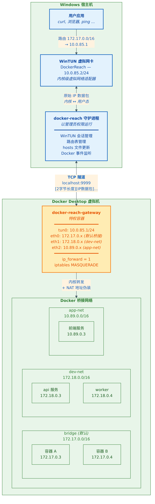

# docker-reach


从 Windows 宿主机直接通过 IP 和容器名访问 Docker Desktop 容器 -- 无需 `-p` 端口映射。

[English](README.md) | [架构详解](docs/ARCHITECTURE_ZH.md)

---

## 解决什么问题

Docker Desktop for Windows 把容器跑在一个隐藏的 WSL2 虚拟机里。容器网络（`172.17.0.0/16` 等）对 Windows 完全不可见，不加 `-p` 就无法 `ping`、`curl` 或连接任何容器。

现有的所有方案（`--net host`、WSL2 镜像网络、`desktop-docker-connector`、Tailscale 子网路由、SOCKS 代理）要么在 Docker Desktop 上不工作，要么需要逐应用配置。

## 怎么解决的

docker-reach 在 Windows 和一个网关容器之间建立轻量 IP 隧道。网关容器直接加入所有 Docker 桥接网络，拥有真实的 L2 连通性。



你的正常上网流量完全不受影响 -- 只有目标是 Docker 子网的数据包才走隧道。

---

## 快速开始

### 前提条件

- Windows 10/11，安装了 Docker Desktop（WSL2 后端）
- 管理员权限
- `wintun.dll`，从 [wintun.net](https://www.wintun.net/) 下载，放在 exe 同目录

### 编译

不需要安装 Go -- 全部通过 Docker 编译。

```powershell
git clone https://github.com/AnFuran/docker-reach.git
cd docker-reach

# 构建网关镜像
docker build -t docker-reach-gateway:latest .

# 编译 Windows 客户端（不需要本地安装 Go）
docker run --rm -v "${PWD}:/src" -w /src golang:1.22-alpine sh -c "CGO_ENABLED=0 GOOS=windows GOARCH=amd64 go build -o docker-reach.exe ./cmd/docker-reach"
```

### 启动

```powershell
# 以管理员身份运行
.\docker-reach.exe up
```

### 使用

```powershell
# 通过 IP 访问
curl http://172.17.0.3:8080
ping 172.17.0.3

# 通过容器名访问
curl http://my-api.docker:3000
ping my-api.docker
```

### 停止

```powershell
# 在运行终端按 Ctrl+C，或：
.\docker-reach.exe down
```

---

## 功能特性

- **IP 直连** -- 任何 Docker 桥接网络上的任何容器，无需端口映射
- **容器名解析** -- `<容器名>.docker` 通过 hosts 文件自动解析
- **多网络支持** -- 网关自动加入所有桥接网络，包括启动后新建的
- **实时更新** -- 容器启停、网络创建删除实时检测
- **零干扰** -- 不影响你的上网路由、代理、VPN 和 WSL2 连接
- **干净关闭** -- Ctrl+C 自动移除适配器、路由、hosts 条目和网关容器

---

## 命令

| 命令 | 说明 |
|------|------|
| `docker-reach up` | 启动隧道（需要管理员权限），阻塞运行直到 Ctrl+C |
| `docker-reach down` | 停止并清理，适用于崩溃或强杀后的清理 |
| `docker-reach status` | 显示隧道状态、子网和容器名→IP 映射表 |

`status` 输出示例：

```
Tunnel:     connected
Subnets:    2
  bridge               172.17.0.0/16
  dev-net              172.18.0.0/16
Containers: 3
  my-api.docker                  172.18.0.3
  my-worker.docker               172.18.0.4
  standalone.docker              172.17.0.3
```

---

## 工作原理（简述）

1. **网关容器**加入所有 Docker 桥接网络，获得真实的以太网接口
2. Windows 上的 **WinTUN 虚拟网卡**捕获发往 Docker 子网的数据包
3. 数据包通过 **TCP 连接**（`localhost:9999`）在守护进程和网关之间传输
4. 网关使用**内核 IP 转发 + NAT** 将数据包送达目标容器
5. **Docker 事件监听器**实时同步路由和 hosts 条目

完整技术细节请参阅[架构详解](docs/ARCHITECTURE_ZH.md)。

---

## 已知限制

- 仅限 Windows（macOS/Linux 可以原生访问容器 IP）
- 仅限 IPv4
- 需要管理员权限
- `wintun.dll` 必须和 exe 在同一目录
- 端口 9999 必须空闲

---

## 许可证

MIT。详见 [LICENSE](LICENSE)。

---

本项目在 [Claude Code](https://claude.ai/code)（Anthropic Claude Opus 4.6）的协助下完成。
