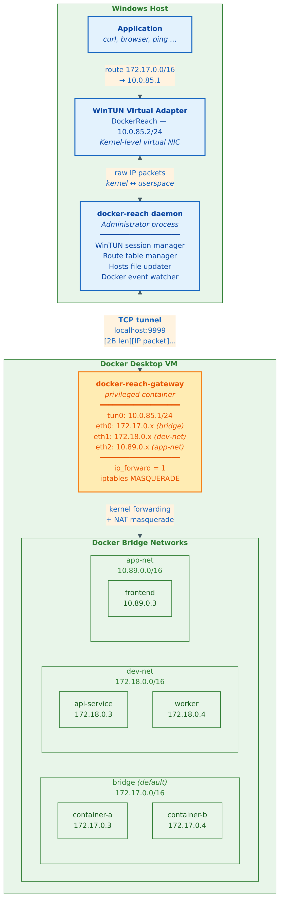
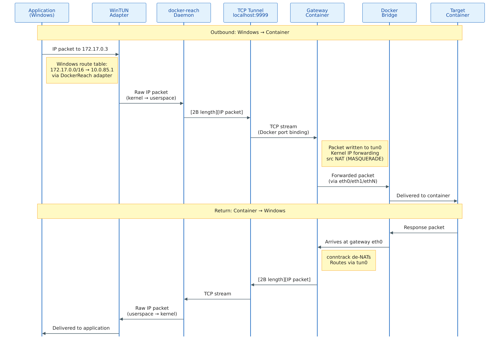

# Architecture Deep Dive

This document describes the internal architecture of docker-reach. For usage instructions, see the [README](../README.md).

---

## Overview





---

## Tunnel Protocol (`internal/tunnel`)

The TCP connection between the Windows daemon and the gateway container carries raw IP packets using a minimal framing protocol:

```
┌──────────┬─────────────────────────────────────────┐
│  2 bytes │           N bytes                       │
│ uint16BE │       raw IPv4 packet                   │
│  length  │                                         │
└──────────┴─────────────────────────────────────────┘
```

A `sync.Mutex` serializes writes so that multiple goroutines can call `Send` concurrently without interleaving partial frames. `Receive` uses `io.ReadFull` to guarantee atomic reads. Maximum packet size is 65535 bytes (the IPv4 maximum). Both send and receive paths use `sync.Pool` to recycle buffers and reduce GC pressure.

---

## WinTUN Adapter (`cmd/docker-reach`)

[WinTUN](https://www.wintun.net/) is a modern Windows kernel TUN driver maintained by the WireGuard project. It exposes a userspace API through `wintun.dll`. docker-reach creates a named adapter called `DockerReach`, assigns it `10.0.85.2/24` via `netsh`, sets the interface metric to 9999 (low priority, so it does not interfere with regular internet routes), then opens a session with a 4 MiB ring buffer for packet I/O.

Packets received from the WinTUN ring (i.e., packets the Windows kernel decided to forward through the adapter) are copied and sent over the tunnel. Packets received from the tunnel are written into the WinTUN send ring, making them appear as inbound packets on the Windows network stack.

On startup, any stale adapter left by a previous crash is detected via `wintun.OpenAdapter` and cleaned up before creating a fresh one.

---

## Gateway Container (`cmd/gateway`)

The gateway runs as a **privileged** Linux container built on Alpine. At startup it:

1. Ensures `/dev/net/tun` exists (creates it via `mknod` if needed).
2. Opens a TUN device named `tun0` using the `songgao/water` library.
3. Configures `tun0` with IP `10.0.85.1/24`.
4. Enables IP forwarding: `sysctl -w net.ipv4.ip_forward=1`.
5. Adds an iptables MASQUERADE rule for traffic sourced from `10.0.85.0/24` (checks for existing rule first to avoid duplicates on restart).
6. Listens on TCP `:9999`. Docker Desktop maps this to `127.0.0.1:9999` on Windows.

Each client connection gets its own context and WaitGroup to manage goroutine lifecycle, preventing race conditions on reconnection.

---

## Network Joining (`internal/dockerutil`)

The `Watcher.ConnectGatewayToNetworks` method lists all Docker bridge networks and calls `docker network connect` for any network the gateway is not yet attached to. It also disconnects from networks that no longer exist. This gives the gateway an `ethN` interface on each bridge with a real IP in that subnet, providing native L2 reachability to every container on that bridge.

This is re-run every time the Docker event watcher fires, so networks created after startup are joined automatically.

---

## Hosts File Management (`internal/dns`)

The `HostsManager` wraps `C:\Windows\System32\drivers\etc\hosts` with a clearly delimited section:

```
# docker-reach BEGIN
172.17.0.3           standalone
172.17.0.3           standalone.docker
192.168.16.2         my-api
192.168.16.2         my-api.docker
# docker-reach END
```

Each container gets two entries (bare name and `.docker` suffix). On each refresh the entire section is removed and rewritten. Writes use an atomic temp-file-then-rename approach with a fallback to direct write if the rename fails (common on Windows due to the DNS Client service holding a handle). On shutdown (`Cleanup`) the section is removed and the rest of the hosts file is left intact.

Container names are sanitized: underscores become hyphens, names containing dots are skipped.

---

## Docker Event Watcher (`internal/dockerutil`)

`Watcher.WatchEvents` subscribes to the Docker events API filtered to `container` and `network` events. On `start`, `stop`, `die`, `connect`, `disconnect`, `create`, or `destroy` it calls a provided callback, which:

1. Reconnects the gateway to any new networks (and disconnects from removed ones).
2. Adds routes for any new subnets (tracked for cleanup on exit).
3. Refreshes the hosts file with the current container list.

---

## Cleanup State Machine

A single `cleanupState` struct tracks every resource that has been successfully initialized (tunnel, adapter, session, routes, hosts, watcher). One `defer cleanupAll()` at the top of `cmdUp` guarantees that everything is torn down regardless of where startup fails or when Ctrl+C arrives. The cleanup is nil-safe and idempotent.

---

## Comparison with Other Approaches

| Approach | Direct IP | Name resolution | UDP/ICMP | Auto-updates | Works on Docker Desktop |
|---|:---:|:---:|:---:|:---:|:---:|
| docker-reach | Yes | Yes (.docker) | Yes | Yes | Yes |
| `-p` port mapping | No | No | No | No | Yes |
| SOCKS proxy | TCP only | Manual | No | No | Yes |
| `--net host` gateway | Broken | No | Broken | No | No |
| WSL2 mirrored networking | No | No | No | No | Partial |
| desktop-docker-connector | Yes | Limited | Yes | Partial | No |
| Tailscale subnet router | Yes | Via MagicDNS | Yes | Yes | Requires account |
