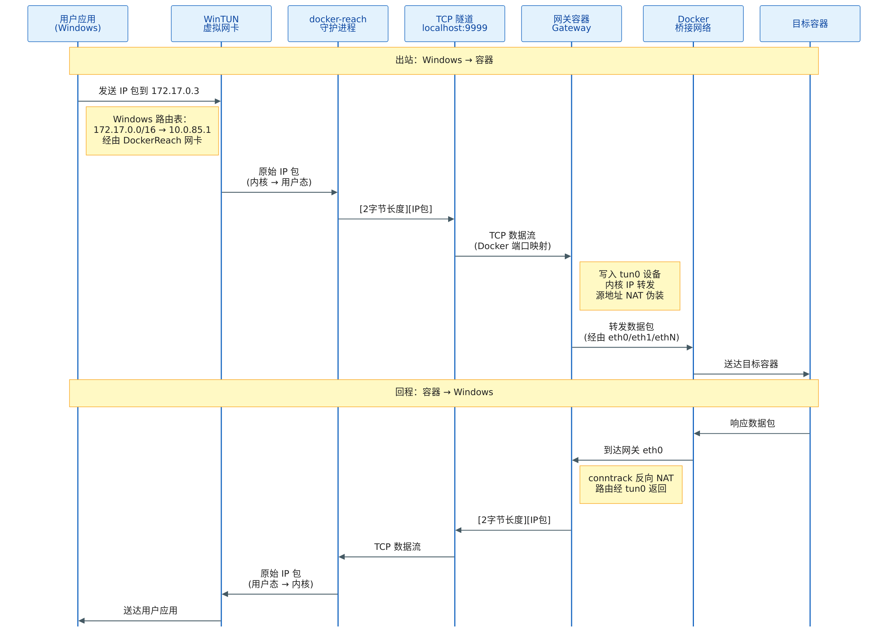

# 架构详解

本文档描述 docker-reach 的内部架构。使用说明请参阅 [README](../README_ZH.md)。

---

## 总览




---

## 隧道协议（`internal/tunnel`）

Windows 守护进程和网关容器之间的 TCP 连接使用极简帧协议传输原始 IP 数据包：

```
┌──────────┬─────────────────────────────────────────┐
│  2 字节  │              N 字节                      │
│ uint16BE │          原始 IPv4 数据包                 │
│   长度   │                                          │
└──────────┴─────────────────────────────────────────┘
```

`sync.Mutex` 序列化写操作，使多个 goroutine 可以并发调用 `Send` 而不会交错帧。`Receive` 使用 `io.ReadFull` 保证原子读取。最大数据包大小为 65535 字节（IPv4 上限）。发送和接收均使用 `sync.Pool` 缓冲池以减少 GC 压力。

---

## WinTUN 适配器（`cmd/docker-reach`）

[WinTUN](https://www.wintun.net/) 是由 WireGuard 团队维护的现代 Windows 内核 TUN 驱动。它通过 `wintun.dll` 暴露用户态 API。docker-reach 创建名为 `DockerReach` 的适配器，通过 `netsh` 分配 `10.0.85.2/24`，将接口度量值设为 9999（低优先级，不干扰正常网络路由），然后以 4 MiB 环形缓冲区打开会话进行数据包 I/O。

启动时会自动检测并清理上次崩溃残留的同名适配器，避免创建失败。

---

## 网关容器（`cmd/gateway`）

网关以**特权模式**运行在 Alpine Linux 容器中。启动时：

1. 确保 `/dev/net/tun` 存在（必要时通过 `mknod` 创建）
2. 使用 `songgao/water` 库创建名为 `tun0` 的 TUN 设备
3. 为 `tun0` 配置 IP `10.0.85.1/24`
4. 启用 IP 转发：`sysctl -w net.ipv4.ip_forward=1`
5. 添加 iptables MASQUERADE 规则（检查是否已存在，避免重启后重复添加）
6. 在 TCP `:9999` 上监听。Docker Desktop 将其映射到 Windows 的 `127.0.0.1:9999`

每个连接使用独立的 context 和 WaitGroup 管理 goroutine 生命周期，确保重连时不会发生竞态。

---

## 网络加入（`internal/dockerutil`）

`Watcher.ConnectGatewayToNetworks` 方法列出所有 Docker 桥接网络，并为网关尚未连接的网络调用 `docker network connect`。同时会断开已不存在的网络连接。这使网关在每个桥接网络上获得一个 `ethN` 接口，拥有该子网中的真实 IP，从而与该桥接网络上的每个容器具有原生 L2 可达性。

每次 Docker 事件触发时都会重新执行此操作，因此启动后创建的网络也会被自动加入。

---

## Hosts 文件管理（`internal/dns`）

`HostsManager` 在 `C:\Windows\System32\drivers\etc\hosts` 中使用明确分界的区块：

```
# docker-reach BEGIN
172.17.0.3           standalone
172.17.0.3           standalone.docker
192.168.16.2         my-api
192.168.16.2         my-api.docker
# docker-reach END
```

每个容器同时注册裸名和 `.docker` 后缀。每次刷新时整个区块会被移除并重写。写入采用原子方式（先写临时文件再重命名，重命名失败时回退到直接写入）。关闭时删除该区块，hosts 文件的其余内容保持不变。

容器名中的下划线会自动替换为连字符（符合 DNS 主机名规范），包含点号的名称会被跳过。

---

## Docker 事件监听器（`internal/dockerutil`）

`Watcher.WatchEvents` 订阅 Docker 事件 API，过滤 `container` 和 `network` 事件。当检测到 `start`、`stop`、`die`、`connect`、`disconnect`、`create` 或 `destroy` 事件时，触发回调：

1. 将网关连接到新网络（并断开已删除的网络）
2. 为新子网添加路由（并纳入清理追踪）
3. 用当前容器列表刷新 hosts 文件

---

## 清理状态机

一个 `cleanupState` 结构体追踪所有已成功初始化的资源（隧道、适配器、会话、路由、hosts、watcher）。`cmdUp` 顶部注册一个 `defer cleanupAll()`，保证无论启动在哪里失败或 Ctrl+C 何时到达，都能完全清理。清理逻辑对 nil 安全且幂等。

---

## 与其他方案的对比

| 方案 | IP 直连 | 名称解析 | UDP/ICMP | 自动更新 | Docker Desktop 可用 |
|------|:------:|:-------:|:--------:|:-------:|:------------------:|
| docker-reach | 支持 | 支持 (.docker) | 支持 | 支持 | 支持 |
| `-p` 端口映射 | 不支持 | 不支持 | 不支持 | 不支持 | 支持 |
| SOCKS 代理 | 仅 TCP | 手动配置 | 不支持 | 不支持 | 支持 |
| `--net host` 网关 | 不工作 | 不支持 | 不工作 | 不支持 | 不支持 |
| WSL2 镜像网络 | 不支持 | 不支持 | 不支持 | 不支持 | 部分 |
| desktop-docker-connector | 支持 | 有限 | 支持 | 部分 | 不支持 |
| Tailscale 子网路由 | 支持 | MagicDNS | 支持 | 支持 | 需要账号 |
